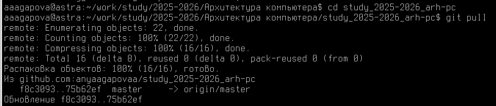
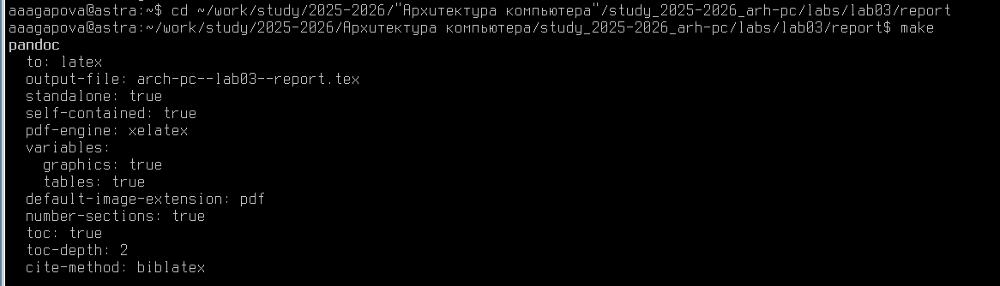
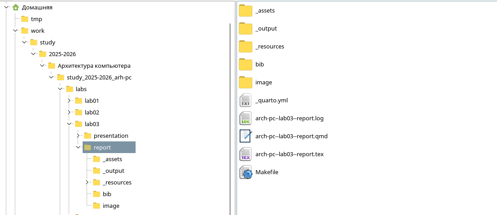
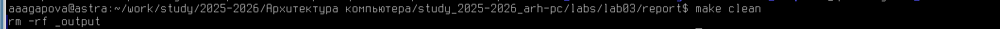
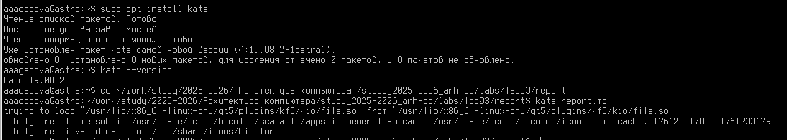
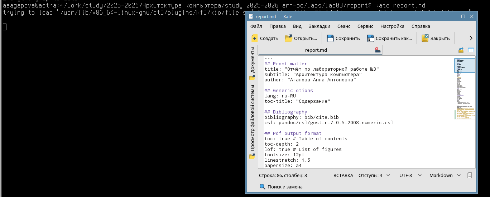
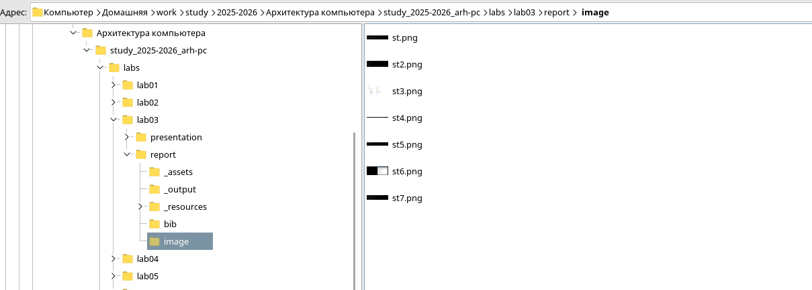
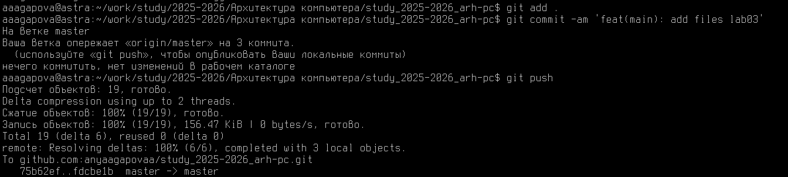
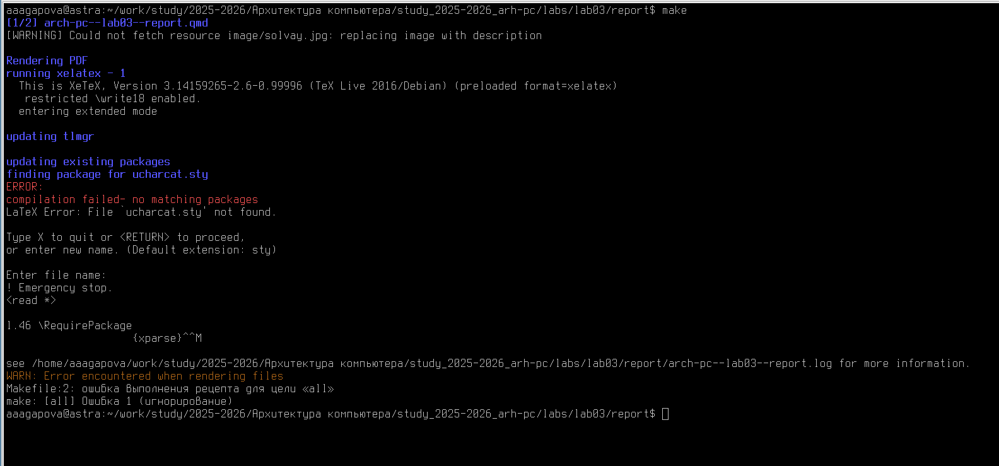

---
## Front matter
title: "Отчёт по лабораторной работе №3"
subtitle: "Архитектура компьютера"
author: "Агапова Анна Антоновна"

## Generic otions
lang: ru-RU
toc-title: "Содержание"

## Bibliography
bibliography: bib/cite.bib
csl: pandoc/csl/gost-r-7-0-5-2008-numeric.csl

## Pdf output format
toc: true # Table of contents
toc-depth: 2
lof: true # List of figures
fontsize: 12pt
linestretch: 1.5
papersize: a4
documentclass: scrreprt
## I18n polyglossia
polyglossia-lang:
  name: russian
  options:
	- spelling=modern
	- babelshorthands=true
polyglossia-otherlangs:
  name: english
## I18n babel
babel-lang: russian
babel-otherlangs: english
## Fonts
mainfont: PT Serif
romanfont: PT Serif
sansfont: PT Sans
monofont: PT Mono
mainfontoptions: Ligatures=TeX
romanfontoptions: Ligatures=TeX
sansfontoptions: Ligatures=TeX,Scale=MatchLowercase
monofontoptions: Scale=MatchLowercase,Scale=0.9
## Biblatex
biblatex: true
biblio-style: "gost-numeric"
biblatexoptions:
  - parentracker=true
  - backend=biber
  - hyperref=auto
  - language=auto
  - autolang=other*
  - citestyle=gost-numeric
## Pandoc-crossref LaTeX customization
figureTitle: "Рис."
tableTitle: "Таблица"
listingTitle: "Листинг"
lofTitle: "Список иллюстраций"
lolTitle: "Листинги"
## Misc options
indent: true
header-includes:
  - \usepackage{indentfirst}
  - \usepackage{float} # keep figures where there are in the text
  - \floatplacement{figure}{H} # keep figures where there are in the text
---

#Цель работы
Целью работы является освоение процедуры оформления отчетов с помощью легковесного языка разметки Markdown.
##Выполнение лабораторной работы
1. Открываю терминал.Перехожу в каталог курса, сформированный при выполнении лабораторной работы
№ 2.Обновляю локальный репозиторий, скачав изменения из удаленного репозитория с помощью команды
git pull.(рис. [-@fig:fig1])
{#fig:fig1 width=60% }
2.Перехожу в каталог с шаблоном отчета по лабораторной работе № 3. Провожу компиляцию шаблона с использованием Makefile. Для этого ввожу команду make. (рис. [-@fig:fig2])
{ #fig:fig2 width=60%}
3.При успешной компиляции должны сгенерироваться файлы report.pdf и report.docx.
Открываю и проверяю корректность полученных файлов.(рис. [-@fig:fig3]) Сгенерировались файлы .log и .tex.
{#fig:fig3 width=60%}
4.Удаляю полученные файлы с использованием Makefile. Для этого ввожу команду make clean.(рис. [-@fig:fig4])
{#fig:fig4 width=60%}
5.Скачиваю текстовый редактор Kate (рис. [-@fig:fig5])
{#fig:fig5 width=60%}
6.Открываю файл report.md c помощью текстового редактора Kate и внимательно изучаю структуру этого файла. (рис. [-@fig:fig6])
{#fig:fig6 width=60%}
7.Заполняю отчет и скомпилирую  отчет с использованием Makefile. Проверяю корректность полученных файлов. Обращаю внимание,что скриншоты размещены в каталоге image. (рис. [-@fig:fig7])
{#fig:fig7 width=60%)
8.Загружаю файлы на Github. (рис. [-@fig:fig8])
{#fig:fig8 width=60%)
###Примечание
Не работает функция make. Я пыталась сделать на своём компьютере на Astra Linux (рис. [-@fig:fig9]) и в компьютерном классе на Ubuntu. (рис. [-@fig:fig10])
{#fig:fig9 width=60%}
####Выводы
В ходе лабораторной работы я освоила процедуры оформления отчетов с помощью легковесного языка разметки Markdown: компелирование отчёта, оформление изображений и текста.
