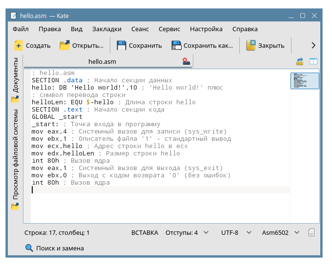
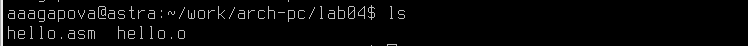
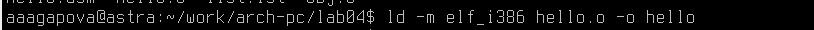
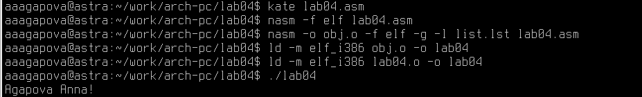

---
## Front matter
title: "Отчёт по лабораторной работе №4"
subtitle: "Архитектура компьютера"
author: "Агапова Анна Антоновна"

## Generic otions
lang: ru-RU
toc-title: "Содержание"

## Bibliography
bibliography: bib/cite.bib
csl: pandoc/csl/gost-r-7-0-5-2008-numeric.csl

## Pdf output format
toc: true # Table of contents
toc-depth: 2
lof: true # List of figures
fontsize: 12pt
linestretch: 1.5
papersize: a4
documentclass: scrreprt
## I18n polyglossia
polyglossia-lang:
  name: russian
  options:
	- spelling=modern
	- babelshorthands=true
polyglossia-otherlangs:
  name: english
## I18n babel
babel-lang: russian
babel-otherlangs: english
## Fonts
mainfont: PT Serif
romanfont: PT Serif
sansfont: PT Sans
monofont: PT Mono
mainfontoptions: Ligatures=TeX
romanfontoptions: Ligatures=TeX
sansfontoptions: Ligatures=TeX,Scale=MatchLowercase
monofontoptions: Scale=MatchLowercase,Scale=0.9
## Biblatex
biblatex: true
biblio-style: "gost-numeric"
biblatexoptions:
  - parentracker=true
  - backend=biber
  - hyperref=auto
  - language=auto
  - autolang=other*
  - citestyle=gost-numeric
## Pandoc-crossref LaTeX customization
figureTitle: "Рис."
tableTitle: "Таблица"
listingTitle: "Листинг"
lofTitle: "Список иллюстраций"
lolTitle: "Листинги"
## Misc options
indent: true
header-includes:
  - \usepackage{indentfirst}
  - \usepackage{float} # keep figures where there are in the text
  - \floatplacement{figure}{H} # keep figures where there are in the text
---

# Цель работы
Освоение процедуры компиляции и сборки программ, написанных на ассемблере NASM.

# Выполнение лабораторной работы
1.Создаю каталог для работы с программами на языке ассемблера NASM (рис. [-@fig-001]).

{#fig-001 width=60%}

2.Перехожу в созданный каталог (рис. [-@fig-002]).

{#fig-002 width=60%}

3.Создаю текстовый файл с именем hello.asm (рис. [-@fig-003]).

{#fig-003 width=60%}

4.Открою этот файл с помощью текстового редактора Kate (рис. [-@fig-004]).

{#fig-004 width=60%}

5.Ввожу в него следующий текст (рис. [-@fig-005]).

{#fig-005 width=60%}

6.Скомпилируем данный текст (рис. [-@fig-006]).

{#fig-006 width=60%}

7.Проверю, что объектный файл был создан (рис. [-@fig-007]).

{#fig-007 width=60%}

8.Скомпилирую исходный файл hello.asm в obj.o и создадим файл листинга list.lst (рис. [-@fig-008]).

{#fig-008 width=60%}

9.Проверю, что файлы были созданы (рис. [-@fig-009]).

{#fig-009 width=60%}

10.Передаю объектный файл на обработку компоновщику (рис. [-@fig-0010]).

{#fig-0010 width=60%}

11.Проверю, что исполняемый файл hello был создан (рис. [-@fig-0011]).

{#fig-0011 width=60%}

12.Задам имя создаваемого исполняемого файла (рис. [-@fig-0012]).

{#fig-0012 width=60%}

13.Запущу на выполнение созданный исполняемый файл, находящийся в текущем каталоге (рис. [-@fig-0013]).

{#fig-0013 width=60%}

14.Создам копию файла hello.asm с именем lab04.asm (рис. [-@fig-0014]).

{#fig-0014 width=60%}

15.Проверяю, что копия создалась с именем lab04.asm (рис. [-@fig-0015]).

{#fig-0015 width=60%}

16.Оттранслирую полученный текст программы lab04.asm в объектный файл. Выполню компоновку объектного файла и запущу получившийся исполняемый файл (рис. [-@fig-0016]).

{#fig-0016 width=60%}

17.Скопирую файлы hello.asm и lab04.asm в локальный репозиторий и загружу файлы на Github.

# Выводы
В ходе выполнения работы, я освоила процедуры компиляции и сборки программ, написанных на ассемблере NASM.

# Список литературы

1. GDB: The GNU Project Debugger. — URL: https://www.gnu.org/software/gdb/.
2. GNU Bash Manual. — 2016. — URL: https://www.gnu.org/software/bash/manual/.
3. Midnight Commander Development Center. — 2021. — URL: https://midnight-commander.
org/.
4. NASM Assembly Language Tutorials. — 2021. — URL: https://asmtutor.com/.
5. Newham C. Learning the bash Shell: Unix Shell Programming. — O’Reilly Media, 2005. —
354 с. — (In a Nutshell). — ISBN 0596009658. — URL: http://www.amazon.com/Learningbash-Shell-Programming-Nutshell/dp/0596009658.
6. Robbins A. Bash Pocket Reference. — O’Reilly Media, 2016. — 156 с. — ISBN 978-1491941591.
7. The NASM documentation. — 2021. — URL: https://www.nasm.us/docs.php.
8. Zarrelli G. Mastering Bash. — Packt Publishing, 2017. — 502 с. — ISBN 9781784396879.
9. Колдаев В. Д., Лупин С. А. Архитектура ЭВМ. — М. : Форум, 2018.
10. Куляс О. Л., Никитин К. А. Курс программирования на ASSEMBLER. — М. : Солон-Пресс,
2017.
11. Новожилов О. П. Архитектура ЭВМ и систем. — М. : Юрайт, 2016.
12. Расширенный ассемблер: NASM. — 2021. — URL: https://www.opennet.ru/docs/RUS/nasm/.
13. Робачевский А., Немнюгин С., Стесик О. Операционная система UNIX. — 2-е изд. — БХВПетербург, 2010. — 656 с. — ISBN 978-5-94157-538-1.
14. Столяров А. Программирование на языке ассемблера NASM для ОС Unix. — 2-е изд. —
М. : МАКС Пресс, 2011. — URL: http://www.stolyarov.info/books/asm_unix.
15. Таненбаум Э. Архитектура компьютера. — 6-е изд. — СПб. : Питер, 2013. — 874 с. —
(Классика Computer Science).
16. Таненбаум Э., Бос Х. Современные операционные системы. — 4-е изд. — СПб. : Питер,
2015. — 1120 с. — (Классика Computer Science).
