---
## Front matter
title: "Отчёт по лабораторной работе №6"
subtitle: "Архитектура компьютера"
author: "Агапова Анна Антоновна"

## Generic otions
lang: ru-RU
toc-title: "Содержание"

## Bibliography
bibliography: bib/cite.bib
csl: pandoc/csl/gost-r-7-0-5-2008-numeric.csl

## Pdf output format
toc: true # Table of contents
toc-depth: 2
lof: true # List of figures
fontsize: 12pt
linestretch: 1.5
papersize: a4
documentclass: scrreprt
## I18n polyglossia
polyglossia-lang:
  name: russian
  options:
	- spelling=modern
	- babelshorthands=true
polyglossia-otherlangs:
  name: english
## I18n babel
babel-lang: russian
babel-otherlangs: english
## Fonts
mainfont: PT Serif
romanfont: PT Serif
sansfont: PT Sans
monofont: PT Mono
mainfontoptions: Ligatures=TeX
romanfontoptions: Ligatures=TeX
sansfontoptions: Ligatures=TeX,Scale=MatchLowercase
monofontoptions: Scale=MatchLowercase,Scale=0.9
## Biblatex
biblatex: true
biblio-style: "gost-numeric"
biblatexoptions:
  - parentracker=true
  - backend=biber
  - hyperref=auto
  - language=auto
  - autolang=other*
  - citestyle=gost-numeric
## Pandoc-crossref LaTeX customization
figureTitle: "Рис."
tableTitle: "Таблица"
listingTitle: "Листинг"
lofTitle: "Список иллюстраций"
lolTitle: "Листинги"
## Misc options
indent: true
header-includes:
  - \usepackage{indentfirst}
  - \usepackage{float} # keep figures where there are in the text
  - \floatplacement{figure}{H} # keep figures where there are in the text
---

# Цель работы
Освоение арифметических инструкций языка ассемблера NASM.

# Выполнение лабораторной работы
1.Создаю каталог для программам лабораторной работы № 6, перехожу в него и создаю файл lab6-1.asm. (рис. [-@fig-001])

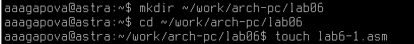{#fig-001 width=60%}

2.Ввожу в файл lab6-1.asm текст программы из листинга 6.1. (рис. [-@fig-002])

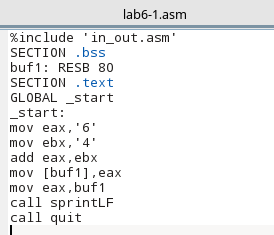{#fig-002 width=60%}

3.Создаю исполняемый файл и запускаю его. (рис. [-@fig-003])

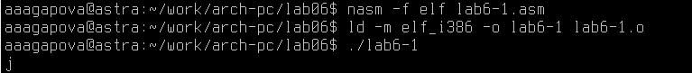{#fig-003 width=60%}

4.Далее изменю текст программы и вместо символов, запишу в регистры числа. (рис. [-@fig-004])

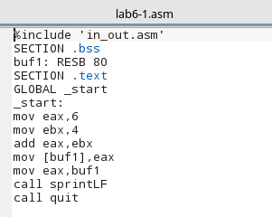{#fig-004 width=60%}

5.Создаю исполняемый файл и запускаю его. (рис. [-@fig-005])

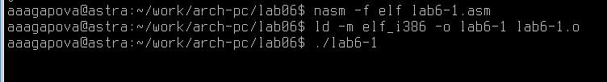{#fig-005 width=60%}

6.Создаю файл lab6-2.asm в каталоге ~/work/arch-pc/lab06 и проверяю его наличие. (рис. [-@fig-006])

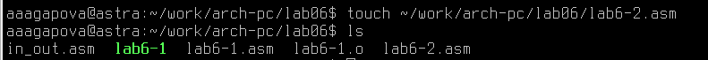{#fig-006 width=60%}

7.Ввожу в созданный файл текст программы из листинга 6.2. (рис. [-@fig-007])

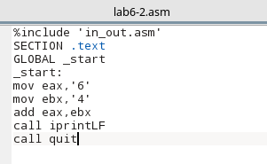{#fig-007 width=60%}

8.Создаю исполняемый файл и запускаю его. (рис. [-@fig-008])

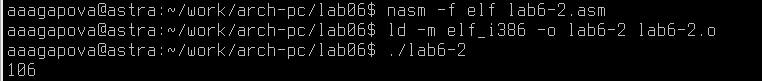{#fig-008 width=60%}

9.Аналогично предыдущему примеру изменю символы на числа. (рис. [-@fig-009])

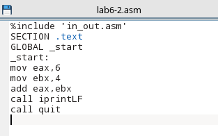{#fig-009 width=60%}

10.Создаю исполняемый файл и запускаю его. (рис. [-@fig-0010])

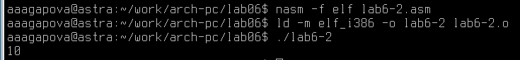{#fig-0010 width=60%}

11.Заменю функцию iprintLF на iprint. (рис. [-@fig-0011])

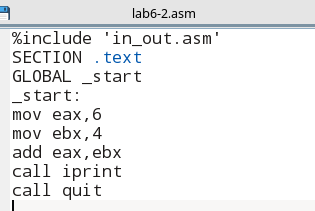{#fig-0011 width=60%}

12.Создаю исполняемый файл и запускаю его. (рис. [-@fig-0012])

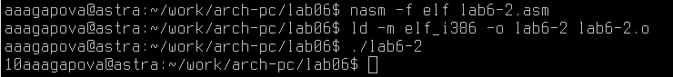{#fig-0012 width=60%}

13.Создаю файл lab6-3.asm в каталоге ~/work/arch-pc/lab06 и проверяю его наличие. (рис. [-@fig-0013])

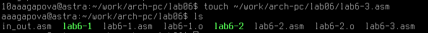{#fig-0013 width=60%}

14.Внимательно изучаю текст программы из листинга 6.3 и ввожу в lab6-3.asm для вычисления арифметического выражения 𝑓(𝑥) = (5 ∗ 2 + 3)/3. (рис. [-@fig-0014])

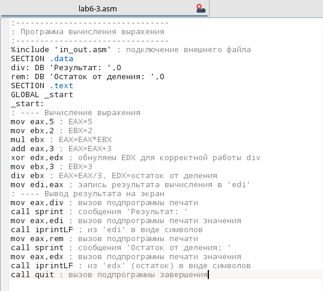{#fig-0014 width=60%}

15.Создаю исполняемый файл и запускаю его. (рис. [-@fig-0015])

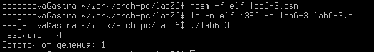{#fig-0015 width=60%}

16.Меняю текст программы для вычисления выражения 𝑓(𝑥) = (4 ∗ 6 + 2)/5. (рис. [-@fig-0016])

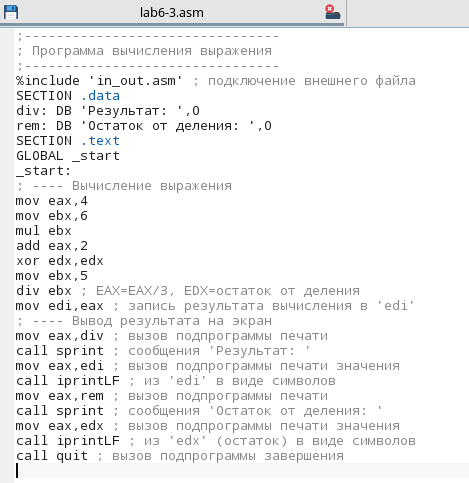{#fig-0016 width=60%}

17.Создаю исполняемый файл и запускаю его. (рис. [-@fig-0017])

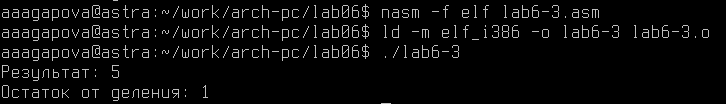{#fig-0017 width=60%}

18.Создаю файл variant.asm в каталоге ~/work/arch-pc/lab06 и проверяю его наличие. (рис. [-@fig-0018])

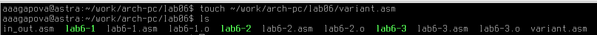{#fig-0018 width=60%}

19.Внимательно изучаю текст программы из листинга 6.4 и ввожу в файл variant.asm. (рис. [-@fig-0019])

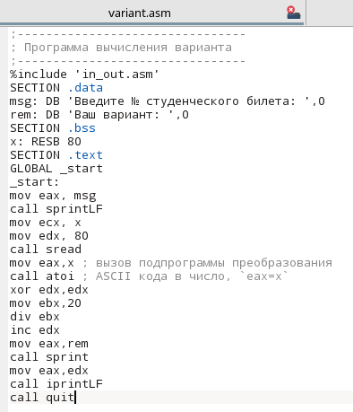{#fig-0019 width=60%}

20.Создаю исполняемый файл и запускаю его. (рис. [-@fig-0020])

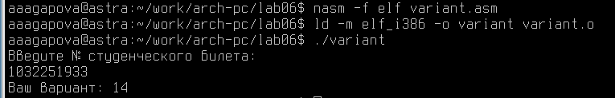{#fig-0020 width=60%}

# Ответы на вопросы
1.За вывод сообщения “Ваш вариант” отвечают строки кода:

mov eax,rem

call sprint

2.Инструкция mov ecx, x используется, чтобы поместить адрес вводимой строки x в регистр ecx, mov edx, 80 - задаёт максимальную длину ввода, call sread - вызывает функцию чтения строки с клавиатуры.

3.call atoi используется для преобразования строки ASCII-коды в число и записывает результат в eax.

4.За вычисления варианта отвечают строки:

xor edx,edx

mov ebx,20

div ebx

inc edx

5.Остаток записывается в регистр edx.

6.inc edx используется для увелечения остатка на 1.

7.За вывод на экран результатов вычислений отвечают строки:

mov eax,rem

call sprint

mov eax,edx

call iprintLf

# Задание для самостоятельной работы
1.Создаю файл lab6-4.asm в каталоге ~/work/arch-pc/lab06 и проверяю его наличие. (рис. [-@fig-0021])

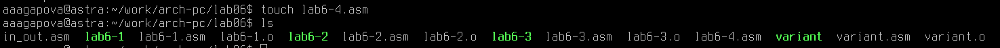{#fig-0021 width=60%}

2.Ввожу в созданный файл программу для вычисления арифметического выражения, которое указано в 14 варианте. (рис. [-@fig-0022])

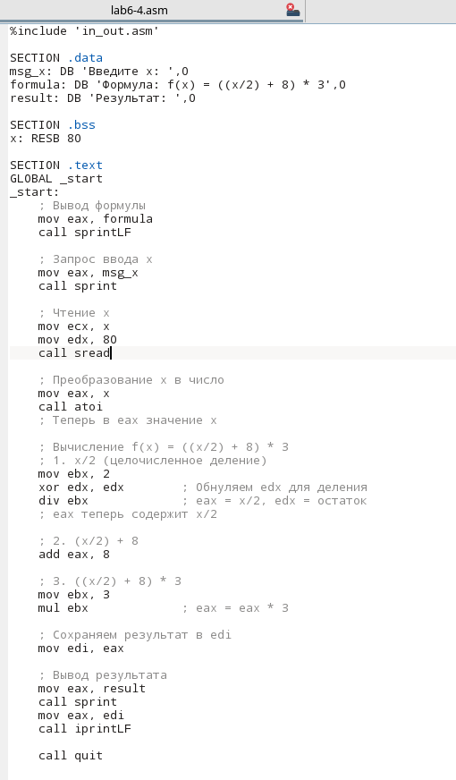{#fig-0022 width=60%}

3.Создаю исполняемый файл и запускаю его для x1=1. (рис. [-@fig-0023])

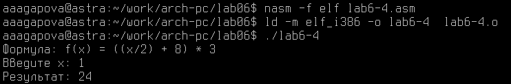{#fig-0023 width=60%}

4.Создаю исполняемый файл и запускаю его для x2=4. (рис. [-@fig-0024])

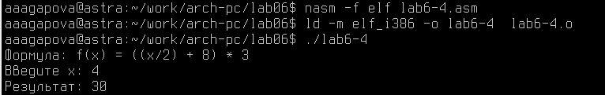{#fig-0024 width=60%}

# Выводы
При выполнении данной лабораторной работы я освоила арифметические инструкции языка ассемблера NASM.

# Список литературы 
1. GDB: The GNU Project Debugger. — URL: https://www.gnu.org/software/gdb/.
2. GNU Bash Manual. — 2016. — URL: https://www.gnu.org/software/bash/manual/.
3. Midnight Commander Development Center. — 2021. — URL: https://midnight-commander.
org/.
4. NASM Assembly Language Tutorials. — 2021. — URL: https://asmtutor.com/.
5. Newham C. Learning the bash Shell: Unix Shell Programming. — O’Reilly Media, 2005. —
354 с. — (In a Nutshell). — ISBN 0596009658. — URL: http://www.amazon.com/Learningbash-Shell-Programming-Nutshell/dp/0596009658.
6. Robbins A. Bash Pocket Reference. — O’Reilly Media, 2016. — 156 с. — ISBN 978-1491941591.
7. The NASM documentation. — 2021. — URL: https://www.nasm.us/docs.php.
8. Zarrelli G. Mastering Bash. — Packt Publishing, 2017. — 502 с. — ISBN 9781784396879.
9. Колдаев В. Д., Лупин С. А. Архитектура ЭВМ. — М. : Форум, 2018.
10. Куляс О. Л., Никитин К. А. Курс программирования на ASSEMBLER. — М. : Солон-Пресс,
2017.
11. Новожилов О. П. Архитектура ЭВМ и систем. — М. : Юрайт, 2016.
12. Расширенный ассемблер: NASM. — 2021. — URL: https://www.opennet.ru/docs/RUS/nasm/.
13. Робачевский А., Немнюгин С., Стесик О. Операционная система UNIX. — 2-е изд. — БХВПетербург, 2010. — 656 с. — ISBN 978-5-94157-538-1.
14. Столяров А. Программирование на языке ассемблера NASM для ОС Unix. — 2-е изд. —
М. : МАКС Пресс, 2011. — URL: http://www.stolyarov.info/books/asm_unix.
15. Таненбаум Э. Архитектура компьютера. — 6-е изд. — СПб. : Питер, 2013. — 874 с. —
(Классика Computer Science).
16. Таненбаум Э., Бос Х. Современные операционные системы. — 4-е изд. — СПб. : Питер,2015. — 1120 с. — (Классика Computer Science).
